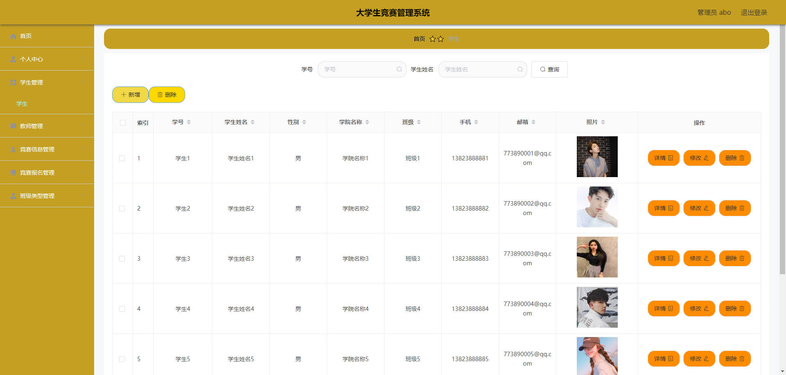
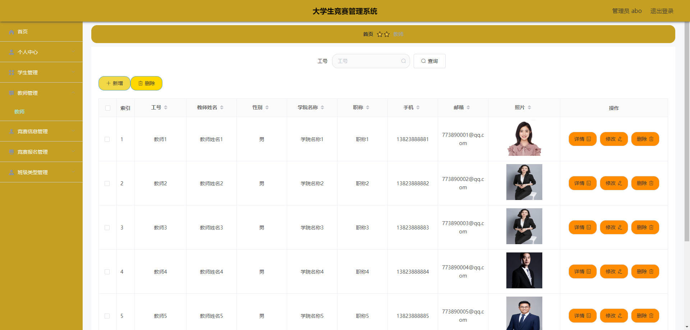
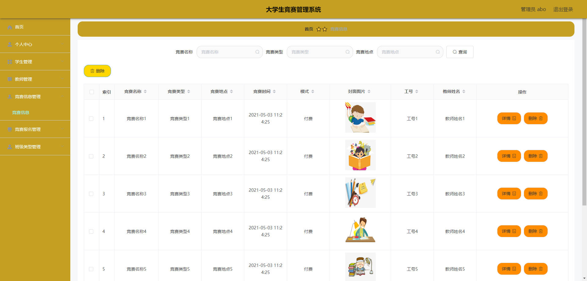
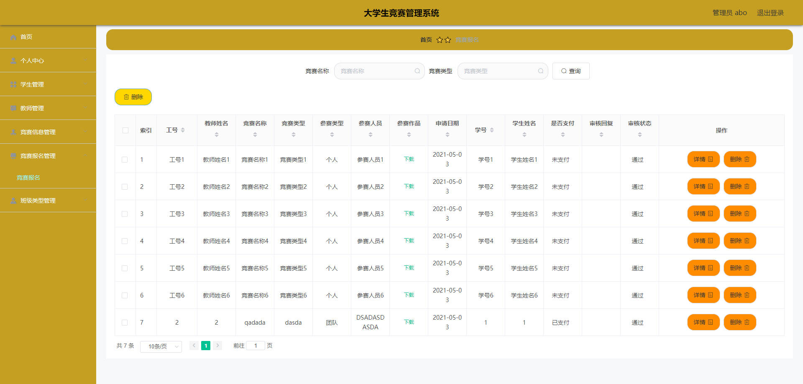
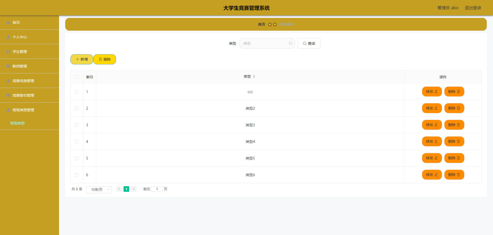
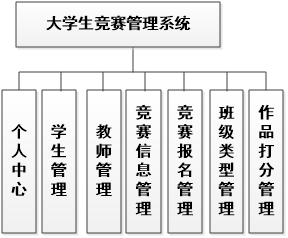
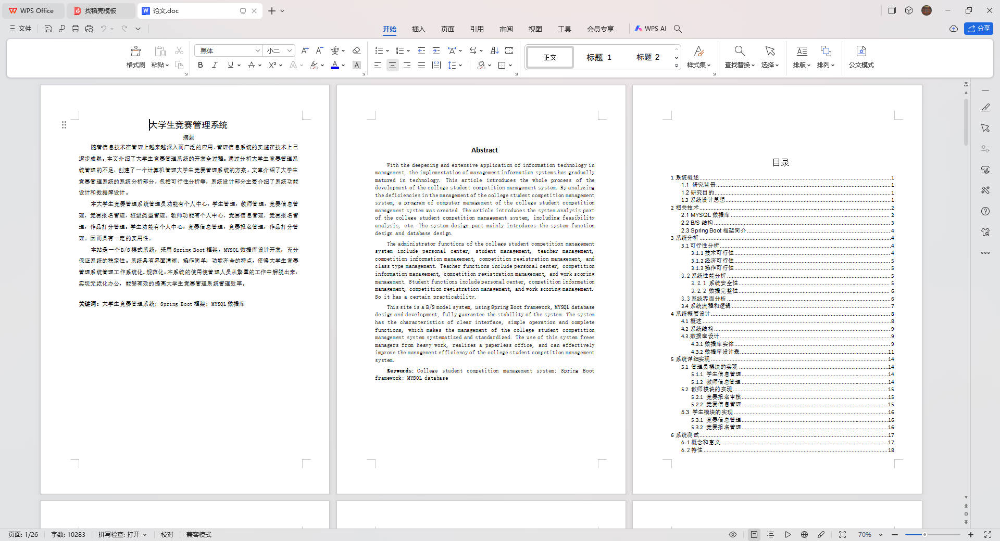

# 基于Springboot的大学生竞赛管理系统

## Springboot-0097


## 技术栈

Springboot mybatisplus vue mysql maven


## 数据库表(9张)


## 功能介绍

```properties
管理员功能有个人中心，学生管理，教师管理，竞赛信息管理，竞赛报名管理，班级类型管理。教师功能有个人中心，竞赛信息管理，竞赛报名管理，作品打分管理。学生功能有个人中心，竞赛信息管理，竞赛报名管理，作品打分管理。
```


## 图片

### 前台

### 后台







## 访问路径

### 前台

```properties

```

### 后台

```properties
http://localhost:8080/springbootrd362/admin/dist/index.html#/login

账号 abo
密码 abo
```


## 功能图




## 文档目录




## 打赏或交流


